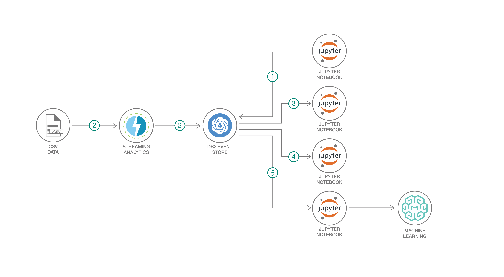

# IoT sensor temperature analysis and prediction with IBM Db2 Event Store

This code pattern demonstrates the use of a Jupyter notebooks to interact with IBM Db2 Event Store -- from the creation of database objects to advanced analytics and machine learning model development and deployment.

The sample data used in this code pattern simulates data collected by real industry IoT sensors. The IoT sample data includes sensor temperature, ambient temperature, power consumption, and timestamp for a group of sensors identified with unique sensor IDs and device IDs.

Db2 Event Store is an in-memory database designed for massive structured data volumes and real-time analytics built on Apache Spark and Apache Parquet Data Format. The solution is optimized for event-driven data processing and analysis. It can support emerging applications that are driven by events such as IoT solutions, payments, logistics and web commerce. It is flexible, scalable and can adapt quickly to your changing business needs over time. Db2 Event Store is available in a free developer edition and an enterprise edition that you can download now. The enterprise edition is free for pre-production and test, please visit the [official product webpage](https://www.ibm.com/products/db2-event-store) for more information.

> Note: Db2 Event Store is built with IBM Watson Studio

After completing this code pattern, you’ll understand how to:

* Interact with Db2 Event Store using Python and a Jupyter notebook
* Visualize data using Matplotlib charts
* Build and test a machine learning model
* Deploy and use the model with Watson Machine Learning



## Flow

1. Create the Db2 Event Store table and feed in the data
1. Query the data
1. Analyze the data with Matplotlib charts
1. Train a temperature prediction model
1. Deploy the model with Watson Machine Learning

## Steps

1. [Clone the repo](#1-clone-the-repo)
2. [Install IBM Db2 Event Store](#2-install-ibm-db2-event-store)
3. [Add the sample IoT data asset](#3-add-the-sample-iot-data-asset)
4. [Create an IBM Db2 Event Store database and table](#4-create-an-ibm-db2-event-store-database-and-table)
5. [Query the table](#5-query-the-table)
6. [Analyze the data](#6-analyze-the-data)
7. [Create and deploy a machine learning model](#7-create-and-deploy-a-machine-learning-model)

<!--
1. [Visualize the data](#6-visualize-the-data)
2. [Create Watson services with IBM Cloud](#2-create-watson-services-with-ibm-cloud)
2. Setup a Event Store database and table
3. Perform multiple data science tasks with Event Store using Jupyter notebooks
4. Interact with Event Store database using REST API
5. Run example IBM Streams and Remote Access Applications with Event Store
-->

### 1. Clone the repo

Clone the `db2-event-store-iot-analytics` repo locally. In a terminal, run:

```bash
git clone https://github.com/IBM/db2-event-store-iot-analytics
```

### 2. Install IBM Db2 Event Store

You can use the Developer Edition or Enterprise Edition of IBM Db2 Event Store.

* To install Db2 Event Store Developer Edition on Mac, Linux, or Windows follow the instructions [here](https://www.ibm.com/support/knowledgecenter/en/SSGNPV_1.1.3/desktop/install.html).

* The Enterprise Edition is free for pre-production and test. You are welcome to visit the [official product webpage](https://www.ibm.com/products/db2-event-store) to get the Enterprise Edition for trial.

### 3. Add the sample IoT data asset

This repository includes a generated sample IoT dataset in CSV format that contains 1 million records. The sample CSV dataset can be found at `data/sample_IOT_table.csv`.

Alternatively, a CSV dataset containing a user-specified number of records can be generated with the provided Python script at `data/generator.py`. A Python environment with pandas and NumPy installed is required to run the script.

```bash
cd db2-event-store-iot-analysis/data
python ./generator.py -c <Record Count>
```

Use the Db2 Event Store UI to add the CSV input file as a data asset.

1. From the upper-left corner `☰` drop down menu, select `My Notebooks`.

   

1. Scroll down and click on `add data assets`.

   

1. Click `browse` and navigate to the `data` directory in your cloned repo. Open the file `sample_IOT_table.csv`.

   

### 4. Create an IBM Db2 Event Store database and table

The Db2 Event Store database and table can be created with one of the Jupyter notebooks provided. Refer to the notebook comments if you need to drop your existing database or table.

The notebook also loads the table with one million records from the CSV file that you added as a project asset.

Use the Db2 Event Store UI to create and run the notebook as follows:

1. From the upper-left corner `☰` drop down menu, select `My Notebooks`.
1. Click on `add notebooks`.
1. Select the `From File` tab.
1. Provide a name.
1. Click `Choose File` and navigate to the `notebooks` directory in your cloned repo. Open the Jupyter notebook file named **`Event_Store_Table_Creation.ipynb`**.
1. Scroll down and click on `Create Notebook`.
1. Edit the `HOST` constant in the first code cell. You will need to enter your host's IP address here.
1. Run the notebook using the menu `Cell  ▷ Run all` or run the cells individually with the play button.

### 5. Query the table

Follow the same process to add and run the notebook. This time choose the file named **`Event_Store_Querying_on_Table.ipynb`**.

This notebook demonstrates best practices for querying the data stored in the IBM Db2 Event Store database. Verify that you have successfully created and loaded the table before continuing.

### 6. Analyze the data

Next, run the data analytics notebook. Use the file **`Event_Store_Data_Analytics.ipynb`**.

This notebook shows how the IBM Db2 Event Store can be integrated with multiple popular scientific tools to perform various data analytics tasks.

### 7. Create and deploy a machine learning model

This section demonstrates building and deploying a machine learning model. The notebook uses Spark MLlib to build and test a prediction model from our IoT temperature sensor data. At the end, it demonstrates how to deploy and use the model.

If you are using the **Enterprise Edition** of Db2 Event Store, the notebook will deploy the model using Db2 Event Store which is built with Watson Studio Local.

If you are using the **Developer Edition** of Db2 Event Store, you need an IBM Cloud Watson Machine Learning service instance to complete the deployment. Follow these steps:

* Sign in and create the service [here](https://console.ng.bluemix.net/catalog/services/machine-learning).
* Click on `Service credentials` and then `New credential` and `Add`.
Use `View credentials` and copy the credentials JSON.
* You will use the JSON to set the `wml_credentials` variable in the notebook.

Load the notebook, using the file **`Event_Store_Data_Analytics.ipynb`**.

## Sample output

See the notebooks with example output here: [notebook examples with result](examples)

## License

This code pattern is licensed under the Apache License, Version 2. Separate third-party code objects invoked within this code pattern are licensed by their respective providers pursuant to their own separate licenses. Contributions are subject to the [Developer Certificate of Origin, Version 1.1](https://developercertificate.org/) and the [Apache License, Version 2](https://www.apache.org/licenses/LICENSE-2.0.txt).

[Apache License FAQ](https://www.apache.org/foundation/license-faq.html#WhatDoesItMEAN)