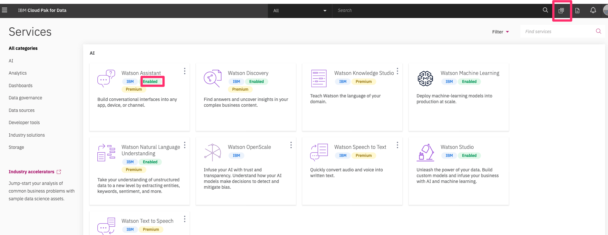
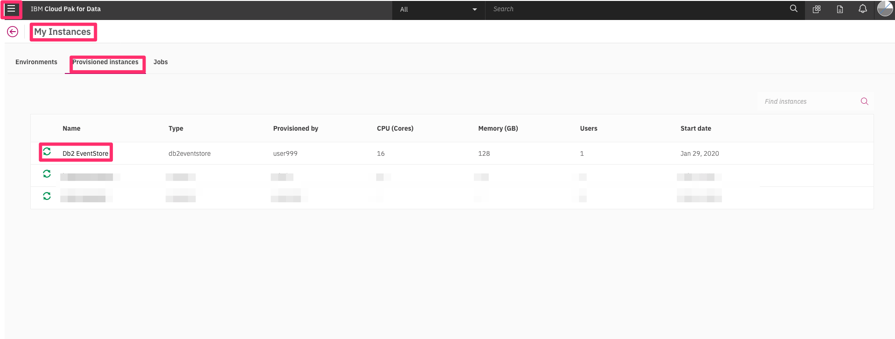
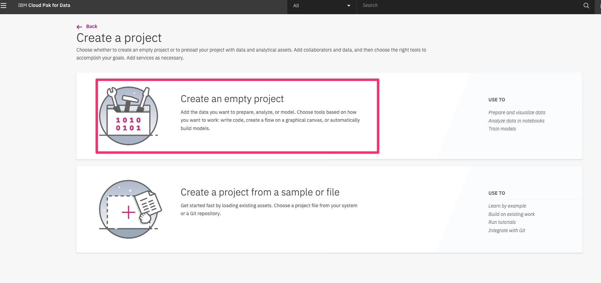
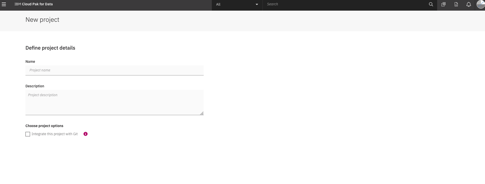
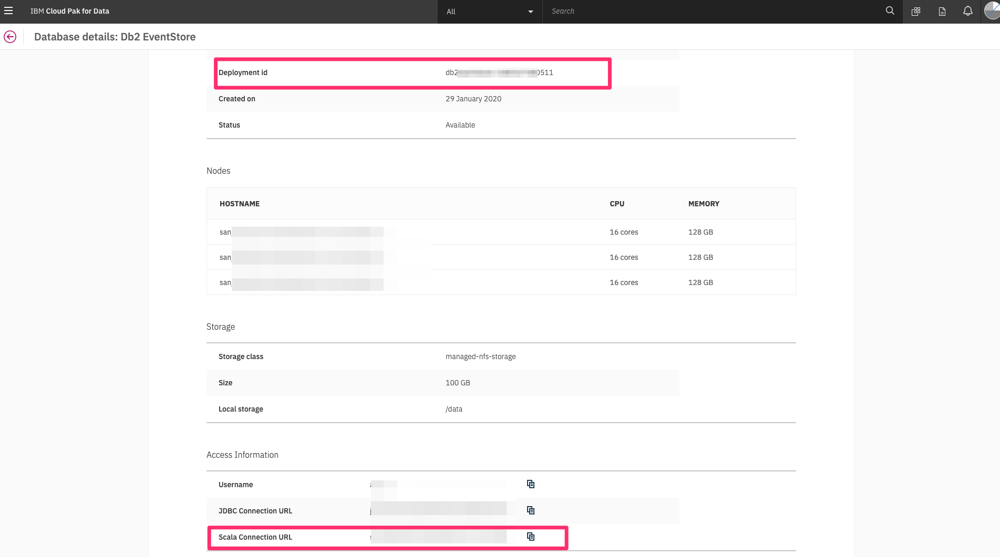
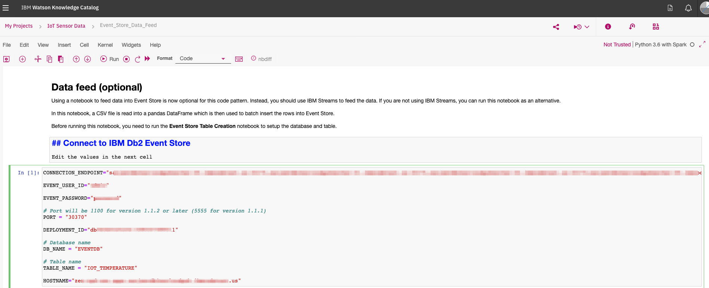
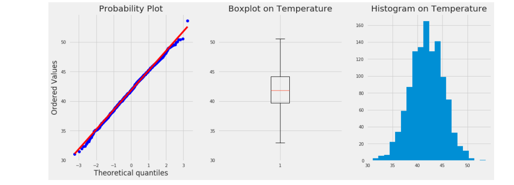
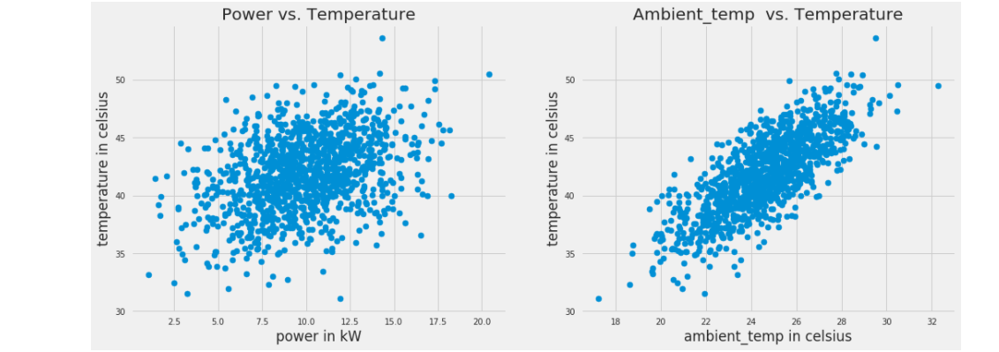

# Db2 Event Store on Cloud Pak for Data

In this readme, we will walk you through step by step instructions on how to use Db2 Event store on cloud pak for data.

## Installing and provisioning service instances

The services are not available by default. An administrator must install them on the IBM Cloud Pak for Data platform, and you must be given access to the service. To determine whether the service is installed, Click the Services icon (see below) and check whether the service that you require is enabled.



Following are the services that you need to get installed and provisioned.

* Watson Studio
* Db2 Event Store
* Watson Machine Learning

By default Jupyter notebooks are availabe part of Watson Studio. You need to make sure `Default Spark Python 3.6 kernel` is available when creating notebooks. If not, your administrator should help you install it.

Once provisioned you can go to the navigation menu, select `My Instances`, click on `Provisioned instances` tab and make sure your instances are available in the list.




## Steps

1. [Clone the repo](#1-clone-the-repo)
2. [Create Watson Studio Project](#2-create-watson-studio-project)
3. [Get Db2 Event Store Credentials](#3-get-db2-event-store-credentials)
4. [Create an IBM Db2 Event Store database and table](#4-create-an-ibm-db2-event-store-database-and-table)
5. [Add the sample IoT data](#5-add-the-sample-iot-data)
6. [Query the table](#6-query-the-table)
7. [Analyze the data](#7-analyze-the-data)
8. [Create and deploy a machine learning model](#8-create-and-deploy-a-machine-learning-model)


### 1. Clone the repo

Clone the `db2-event-store-iot-analytics` repo locally. In a terminal, run:

```bash
git clone https://github.com/IBM/db2-event-store-iot-analytics
```

### 2. Create Watson Studio Project

Login to your IBM cloud Pak for Data cluster. From the hamburger menu, click `Projects` -> ` + New project`, select `Create an empty project`, fill out the details and click `Create`.





### 3. Get Db2 Event Store Credentials

Go to `My instances` from the hamburger menu and select `Provisioned instances`. Click on 3 dots on the far right of the `Db2 Event Store` instance and click `View details`. Copy the `Deployment id` from the `Db2 EventStore` section and Copy the `Scala Connection URL` from the `Access Information` section at the bottom and save it for future use.



### 4. Create an IBM Db2 Event Store database and table

The Db2 Event Store database and table can be created with one of the Jupyter notebooks provided. Refer to the notebook comments if you need to drop your existing database or table.

1. From `Assets` tab in your Watson Studio project, click `+ Add notebook`.
1. Select the `From File` tab.
1. Provide a name.
1. Click `Choose File` and navigate to the `notebooks-cpd` directory in your cloned repo. Open the Jupyter notebook file named **`Event_Store_Table_Creation.ipynb`**.
1. Make sure to choose `Default Spark Python3.6` kernel. Scroll down and click on `Create Notebook`.
1. Edit the Credentials constant in the first code cell as shown in the image below.

1. Run the notebook using the menu `Cell ▷ Run all` or run the cells individually with the play button.

### 5. Add the sample IoT data

#### Generate the data

This repository includes a generated sample IoT dataset in CSV format that contains 1 million records. The sample CSV dataset can be found at `data/sample_IOT_table.csv`.

Alternatively, a CSV dataset containing a user-specified number of records can be generated with the provided Python script at `data/generator.py`. A Python environment with pandas and NumPy installed is required to run the script.

```bash
cd db2-event-store-iot-analytics/data
python ./generator.py -c <Record Count>
```

1. From `Assets` tab in your Watson Studio project, click `Find and add data` icon on top right. and upload the generated file or the provided file `data/sample_iot_table.csv` from the cloned repository. 
1. Similar to step #4, Add the **`Event_Store_Data_Feed.ipynb`** notebook, modify the credentials and run the notebook.

The notebook loads the table with one million records from the CSV file that you added as a project asset.

### 6. Query the table

Follow the same process to add and run a notebook from `notebooks-cpd` directory. This time choose the file named **`Event_Store_Querying.ipynb`**.

This notebook demonstrates best practices for querying the data stored in the IBM Db2 Event Store database. Verify that you have successfully created and loaded the table before continuing.

### 7. Analyze the data

Next, run the data analytics notebook from `notebooks-cpd` directory. Use the file **`Event_Store_Data_Analytics.ipynb`**, modify the credentials in the first cell and run.

This notebook shows how the IBM Db2 Event Store can be integrated with multiple popular scientific tools to perform various data analytics tasks. As you walk through the notebook, you'll explore the data to filter it and example the correlation and covariance of the measurements. You'll also use some charts to visualize the data.

#### Probability plots, box plots, and histograms for temperature data



#### Scatter plots to show the relationship between measurements



### 8. Create and deploy a machine learning model

This section demonstrates building and deploying a machine learning model. The notebook uses Spark MLlib to build and test a prediction model from our IoT temperature sensor data. At the end, it demonstrates how to deploy and use the model.

In order to create and deply machine learning model, make sure `Watson Machine Learning` service is enabled.

Also in your project create a `Deployment space`. Go to your project, click `Settings` tab, and Add a deployment space. Make sure to copy the deployment space name to use it in the notebook.

Load the notebook, using the file **`Event_Store_ML_Model_Deployment.ipynb`** from from `notebooks-cpd` directory, modify the credentials and click run. This will create the model and deploy it.

Note to add the `DEPLOYMENT_SPACE` constant in the first cell.

#### Given a new data point

```python
new_data = {"deviceID" : 2, "sensorID": 24, "ts": 1541430459386, "ambient_temp": 30, "power": 10}
```

#### The result includes a predicted temperature

```python
predictions:  [48.98055760884435]
```

## License

This code pattern is licensed under the Apache License, Version 2. Separate third-party code objects invoked within this code pattern are licensed by their respective providers pursuant to their own separate licenses. Contributions are subject to the [Developer Certificate of Origin, Version 1.1](https://developercertificate.org/) and the [Apache License, Version 2](https://www.apache.org/licenses/LICENSE-2.0.txt).

[Apache License FAQ](https://www.apache.org/foundation/license-faq.html#WhatDoesItMEAN)